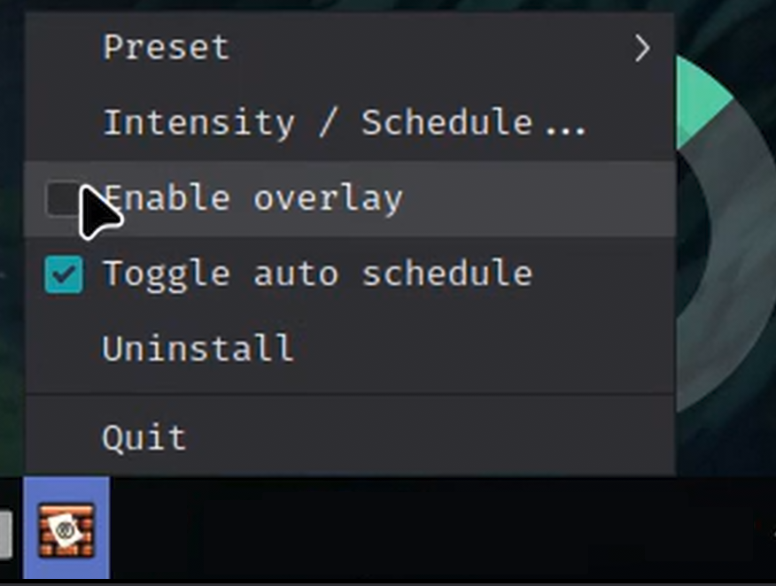
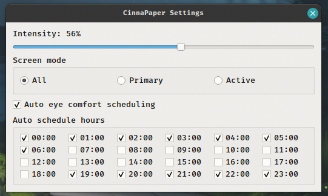
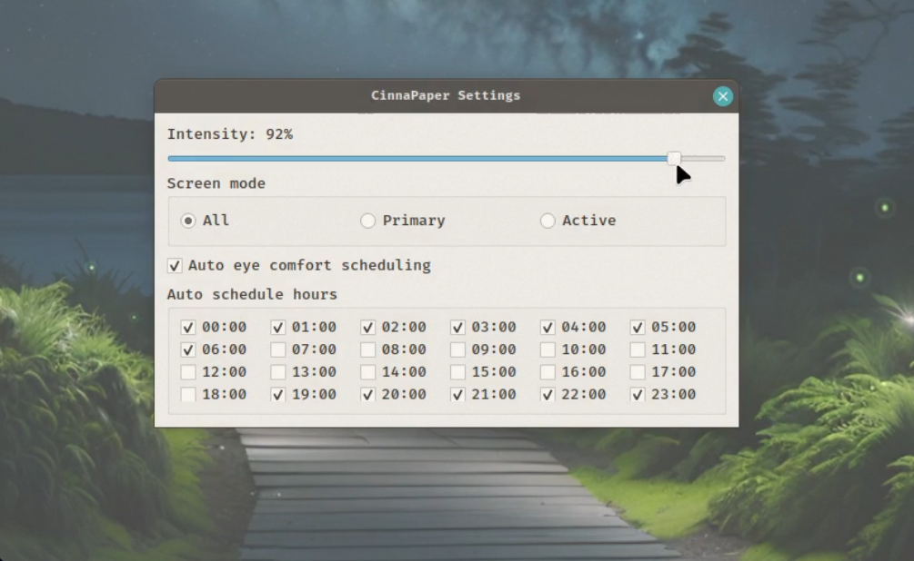

 <h1>CinnaPaper</h1>
<hr/>
A fullscreen, click-through paper-like overlay for Linux Mint/Cinnamon that reduces eye strain with customizable presets, automatic scheduling, and multi-monitor support.

## Features

- **Click-through overlay** — does not block normal desktop interaction
- **Multiple paper presets**: sepia, cool, ink, parchment, mist, night, eyecomfort, warm, study, darkcomfort
- **Customizable intensity** — adjust opacity with slider (0-100%)
- **Auto eye-comfort scheduling** — automatically switch presets based on time of day
- **Custom schedule hours** — enable/disable specific 24-hour periods for auto eye-comfort
- **Multi-monitor support** — overlay all screens, primary only, or active screen
- **Soft grain texture** — adds paper-like authenticity
- **Settings persistence** — saves your preferences
- **System tray integration** — quick access to presets and settings

 
 
 

## Installation

### Using the installer (recommended)

```bash
bash install.sh
```

This will:
- Copy application files to `~/.local/share/cinnapaper/`
- Create a desktop launcher in `~/.local/share/applications/`
- Install the application icon
- Generate the desktop `Exec` line using your current user home directory
- Auto-start the app on login
- Install Python dependencies if needed
- Make the app available in your application menu

### Manual installation

1. Clone or download the repository
2. Install dependencies:
   ```bash
   pip install -r requirements.txt
   ```
3. Run directly:
   ```bash
   python3 paper_overlay.py
   ```

## Usage

### Quick start

```bash
./run_paper_overlay.sh
```

Or launch from your application menu.

### Command-line options

```bash
python3 paper_overlay.py [OPTIONS]

Options:
  --preset {sepia|cool|ink|parchment|mist|night|eyecomfort|warm|study|darkcomfort}
                        Paper preset (default: sepia)
  --opacity OPACITY     Base opacity (default: 0.92)
  --grain GRAIN         Grain intensity (default: 0.22)
  --intensity INTENSITY Initial intensity 0-1 (default: 0.65)
  --screen-mode {all|primary|active}
                        Which screens to cover (default: all)
  --auto-schedule       Enable automatic eye-comfort scheduling
```

### Keyboard shortcuts

- `1-9`: Switch between presets
- `P`: Toggle grain texture
- `Esc`: Quit

### Settings

Right-click the system tray icon to:
- Select different presets
- Adjust intensity and schedule
- Configure screen mode
- Enable/disable auto eye-comfort scheduling
- Customize schedule hours (24-hour grid)

### Configuration

Settings are saved to `~/.config/cinnapaper/settings.json` and loaded automatically on startup.

## Requirements

- Python 3.6+
- PyQt5
- X11 session (not Wayland)
- Linux Mint 19+ or Cinnamon 3.8+

## Uninstallation

If installed with the installer:

```bash
bash uninstall.sh
```

## Notes

- **Wayland users**: This app requires X11. Switch to an X11 session in your login screen.
- **Performance**: The overlay uses minimal CPU and memory.
- **Eye comfort**: The `eyecomfort` and `study` presets are recommended for extended screen time.
- **Auto scheduling**: By default covers 19:00–07:00 (customizable).

## License

MIT
